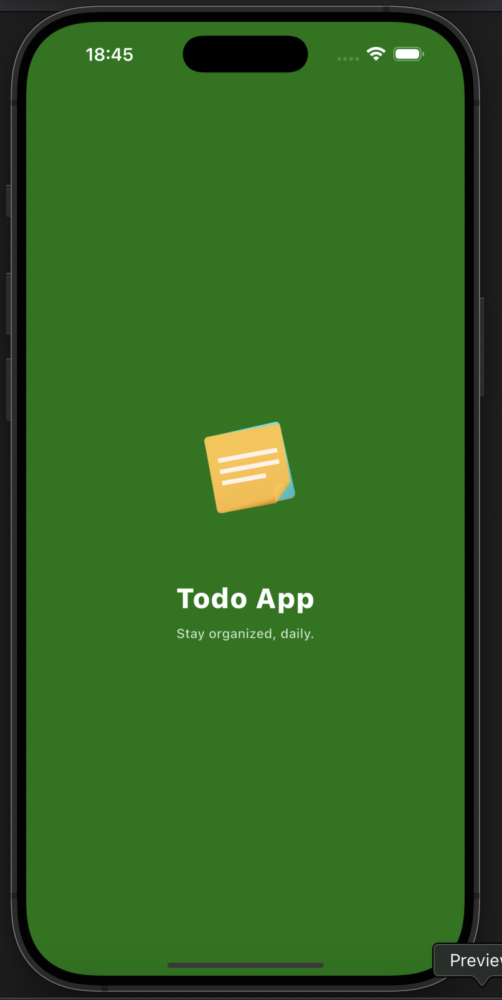
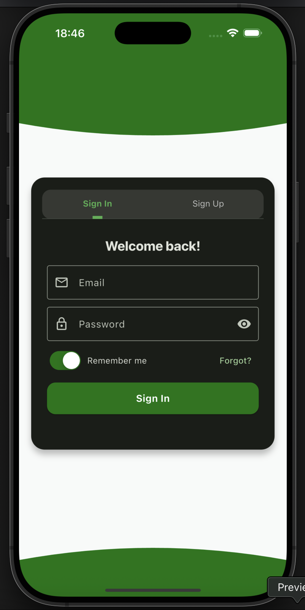
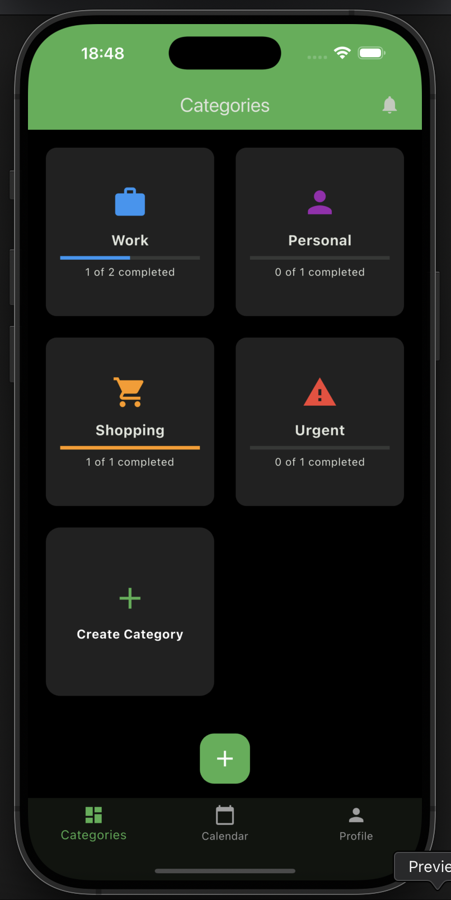
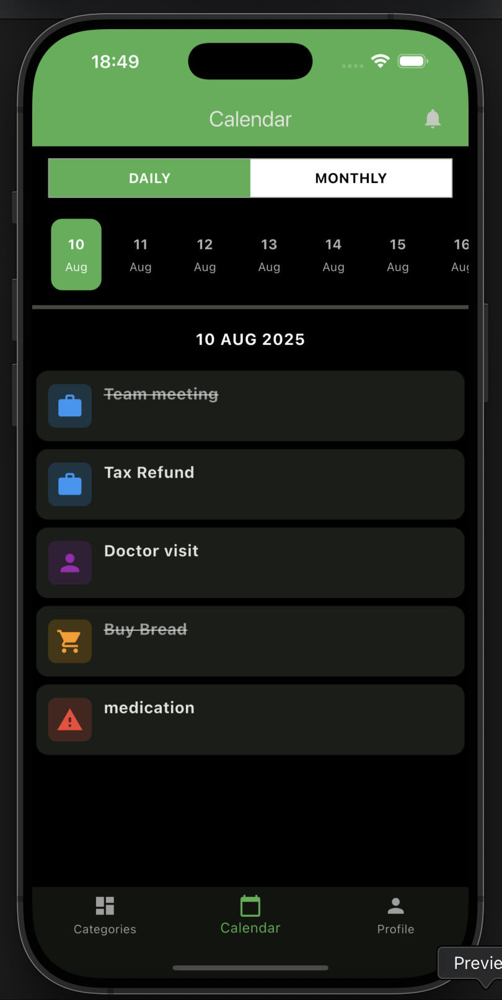
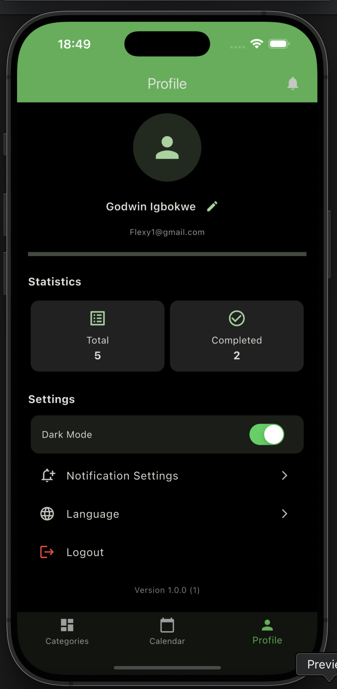

# Todo App

A cross-platform **Flutter To-Do application** with **Hive local storage**, **dark mode**, and **smooth Lottie animations** — built as part of my journey back into coding.

---

## Features
- **Create, edit, delete** tasks  
- Mark tasks as **completed**  
- **Category management** (default + custom)  
- **Reminders** with local notifications  
- **Dark mode toggle** (saved via SharedPreferences)  
- **Lottie animations** for task actions  
- **Hive** local persistence (offline support)  
- Works on **iOS & Android**

---

## 📸 Screenshots

### Row 1
| Splash Screen | Auth Screen | Home |
|---------------|-------------|------|
|  |  |  |

### Row 2
| Task List | Profile Page |
|-----------|--------------|
|  |  |

##  Tech Stack
- **Flutter** – UI framework  
- **Dart** – Programming language  
- **Hive** – Local database  
- **Provider** – State management  
- **Lottie** – Animations

---

## Getting Started

```bash
# Clone the repository
git clone https://github.com/Flexydea/todo_app.git

# Go into the project directory
cd todo_app

# Install dependencies
flutter pub get

# Run the app
flutter run